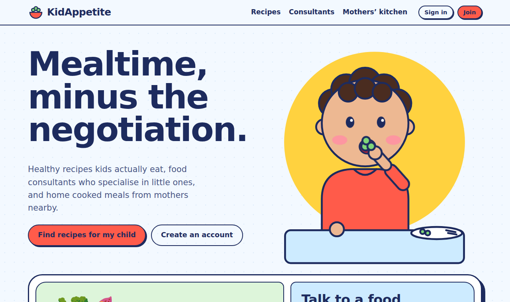

# KidAppetite 🥦

**KidAppetite pairs a library of kid approved, genuinely healthy recipes with real food consultants, so mealtime stops being a negotiation and starts being easy.** Parents can also order home cooked meals from approved mothers nearby who have a child the same age.

**Live demo:** https://elibabakhani.github.io/KidAppetite/



## The problem

Feeding young children is one of the most common sources of daily stress for parents. It gets harder when a child has autism or sensory sensitivities, type 1 diabetes, celiac disease, reflux or allergies. Parents piece together advice from search results, social media and short doctor visits, and specialist food consultants are hard to find and book.

## The solution

KidAppetite brings three things into one place:

| Feature | What it does |
| --- | --- |
| **Recipes matched to your child** | Parents enter age, weight, height, conditions (autism, diabetes, celiac, constipation, reflux, picky eating), allergies and a free text question. KidAppetite filters out unsafe recipes and ranks the rest by what suits the child. |
| **Food consultants** | A directory of children's nutrition specialists, online and in person. Parents filter by need, pick a date and time from the consultant's live calendar, and book. |
| **Mothers' kitchen** | Approved mothers post what they cooked each day, with suitable ages, allergens, portions, price and pickup window. Families nearby order before it sells out. |

## Who uses it

| Role | Can do |
| --- | --- |
| **Parent** | Create an account with their child, get matched recipes, book consultants, order meals |
| **Mother** | Everything a parent can do, plus apply to cook. After approval she posts daily meals and earns from each order |
| **Consultant** | Create a profile, set specialties and weekly availability, see upcoming sessions and the parent's notes |
| **KidAppetite team** | Approve or decline mothers who apply to cook and consultants who apply to be listed |

## Try it

Open the live demo and choose **Sign in**. Sample accounts let you see every role:

| Account | Shows |
| --- | --- |
| Sara Moradi | A parent with a picky toddler and a booked session |
| Lena Park | An approved mother who cooks |
| Carla Mendes | A mother waiting for approval |
| Dr. Nadia Rahimi | A consultant with a booking |
| KidAppetite Team | The approvals screen |

Data is saved in your browser only. Use **Reset demo data** in the footer to start fresh.

## Tech

This prototype is plain HTML, CSS and JavaScript with no build step, so it runs directly on GitHub Pages.

```
KidAppetite/
├── index.html           The whole app: layout, styles, sample data and code
├── README.md            This page
└── screenshot-home.png  Screenshot for this README
```

* **Routing:** hash based (`#/recipes`, `#/consultants/:id`, `#/kitchen`, `#/dashboard`, `#/admin`)
* **Data:** a small store saved to `localStorage`
* **Recipe matching:** hard filters for allergens and celiac, then ranking by tags that fit each condition
* **Booking:** open slots are generated from each consultant's weekly availability minus existing bookings
* **Accessibility:** keyboard focus styles, focus moves to the page title on navigation, reduced motion respected, high contrast palette

## Run it locally

```bash
git clone https://github.com/EliBabakhani/KidAppetite.git
cd KidAppetite
python3 -m http.server 8000
# open http://localhost:8000
```

## Deploy to GitHub Pages

1. Upload `index.html`, `README.md` and `screenshot-home.png` to the `main` branch of the `KidAppetite` repository.
2. In the repository, go to **Settings > Pages**.
3. Under **Build and deployment**, choose **Deploy from a branch**, then `main` and `/ (root)`.
4. Save. The site appears at `https://elibabakhani.github.io/KidAppetite/` within a minute or two.

## Road to production

The prototype proves the flows. A real launch needs:

* **Accounts and data:** a backend such as Supabase (Postgres, auth, row level security per role) replacing `localStorage`
* **Payments:** Stripe Connect so mothers and consultants are paid out directly, with KidAppetite taking a platform fee
* **Calendars:** two way sync with Google or Outlook calendars, video links for online sessions, reminders by email and SMS
* **Verification:** credential checks for consultants, food safety certificate upload and kitchen checks for mothers
* **Food safety and law:** selling home prepared food is regulated. Confirm local health authority rules, permits, labelling and insurance before mothers start selling
* **Privacy:** children's health details are sensitive. Encrypt them, collect clear consent, and follow the privacy law where you operate (for example PIPEDA in Canada)
* **Clinical review:** have a registered dietitian review every recipe and every condition note

## Disclaimer

KidAppetite shares general food ideas, not medical advice. Families should always check with their child's doctor or dietitian.

## Author

Built by **Elnaz Babakhani**, Technical Product Manager.
[LinkedIn](https://www.linkedin.com/in/elnaz-babakhani/) · [GitHub](https://github.com/EliBabakhani)
